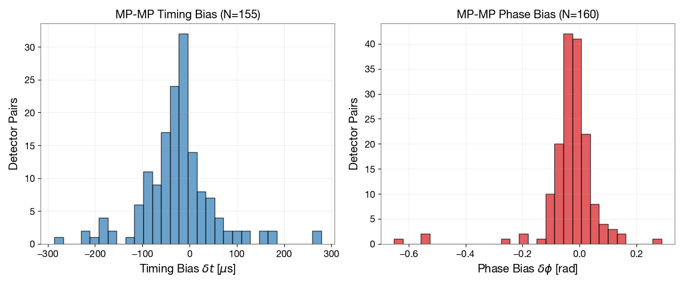
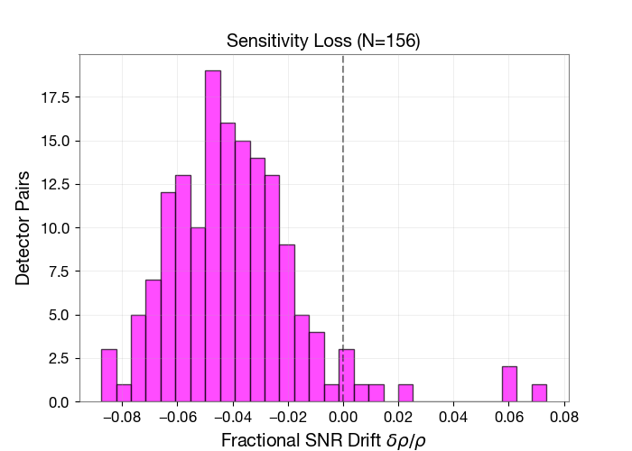
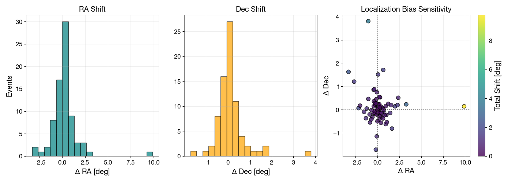

  <a class="btn btn-primary" href="https://arxiv.org/abs/2603.09132" role="button" target="_blank" style="margin-right: 10px;">
    <i class="bi bi-file-earmark-pdf"></i> Read Paper (ArXiv)
  </a>
  <a class="btn btn-outline-primary" href="https://git.ligo.org/james.kennington/zlw" role="button" target="_blank">
    <i class="bi bi-code-slash"></i> View Code
  </a>

## The Problem: Noise Drift in Real-Time Searches

To enable multi-messenger astronomy, gravitational-wave pipelines must generate zero-latency alerts to catch the early optical counterparts of mergers. This requires matched-filtering strain data against theoretical templates using a "lagged" estimate of the detector's Power Spectral Density (PSD).

However, detector noise fluctuates continuously. This spectral drift creates a mismatch that warps the matched-filter metric, severely biasing timing estimates and degrading sky-localization.

## The Solution: Dual Cutler-Vallisneri Corrections

Building on low-latency methods by Tsukada et al. [@tsukada_application_2018], we generalized the classic Cutler-Vallisneri formalism to compute metric shifts caused specifically by PSD drift. 

The result is a set of analytic, causal, and computationally cheap corrections for the timing and phase biases. These first-order corrections for timing ($\delta t^{(1)}$) and phase ($\delta \phi^{(1)}$) are power-weighted spectral averages of the whitening phase mismatch:

$$
\delta t^{(1)} = \frac{\int (2\pi f) \Phi_a(f) w(f) df}{\int (2\pi f)^2 w(f) df}, \quad \delta \phi^{(1)} = \frac{\int \Phi_a(f) w(f) df}{\int w(f) df}
$$

Here, $\Phi_a(f)$ is the whitening phase perturbation induced by the drift, and $w(f)$ is the whitened signal power. 

{#fig-biases width=60% fig-align="center"}

## Validation and Impact

We validated this framework using real GWTC-4.0 strain data. As seen above, uncorrected 1-week PSD drift can induce severe systematics. Beyond coordinate shifts, this drift also directly suppresses the recovered signal amplitude.

{#fig-snr-drift width=50% fig-align="center"}

Applying our mathematical framework successfully restores these parameters. Crucially, this eliminates the artificial broadening of early-warning sky maps, ensuring rapid alerts remain highly accurate for telescopes hunting for electromagnetic counterparts.

{#fig-sky-impact width=60% fig-align="center"}

For the complete derivation, see the full paper [@kennington_dual_2026].

## References

::: {#refs}
:::