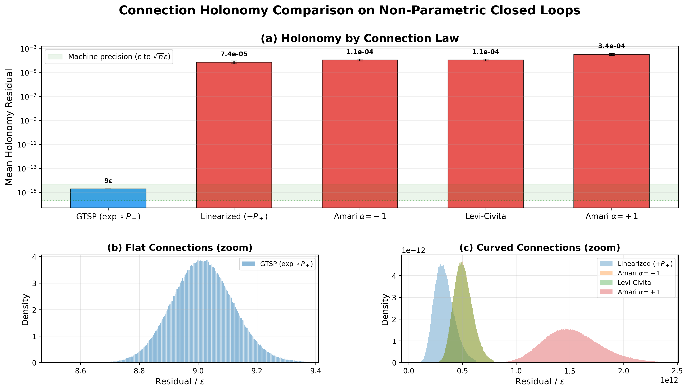
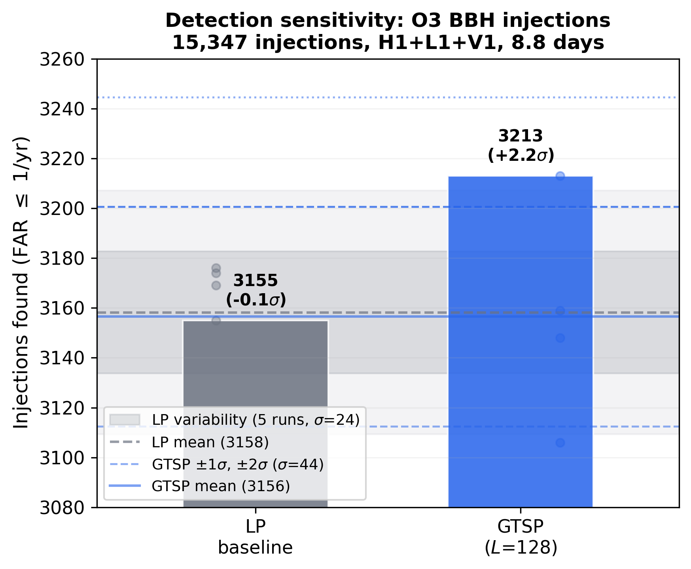
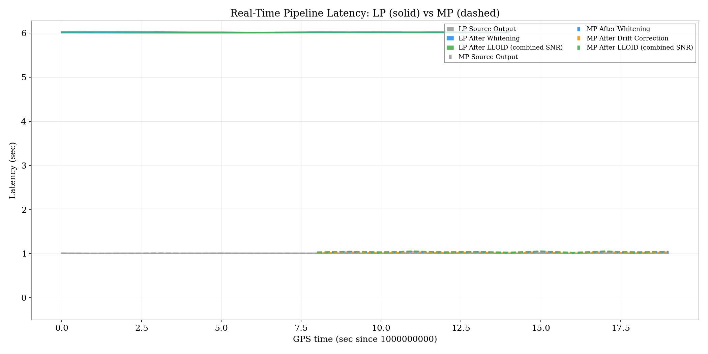

  <a class="btn btn-primary" href="https://arxiv.org/abs/2604.25116" role="button" target="_blank" style="margin-right: 10px;">
    <i class="bi bi-file-earmark-pdf"></i> Read Paper (ArXiv)
  </a>
  <a class="btn btn-outline-primary" href="https://git.ligo.org/james.kennington" role="button" target="_blank">
    <i class="bi bi-code-slash"></i> View Code
  </a>

## Motivation

Early-warning gravitational-wave alerts live and die by latency. Every second between a merger and its public alert is a second in which an optical telescope could already be slewing toward the kilonova. Yet today's low-latency pipelines whiten their data with **acausal, linear-phase** filters that need a look-ahead buffer, and that buffer alone injects several seconds of algorithmic delay.

The obvious fix, causal **minimum-phase** whitening, is subtle in practice. Under non-stationary noise you cannot simply swap the filter type: the drifting PSD must be tracked without eroding matched-filter SNR, each filter update must *stay* minimum-phase, and the altered phase response must be compensated so sky localization does not suffer. In [Paper I](20260407-paper-gtsp-c1.qmd) we showed the minimum-phase connection gives a geometrically exact update rule for exactly this situation. This paper validates that framework numerically, operationally, and at production scale. [@kennington_gauge_ii_2026]

{#fig-causality width=75% fig-align="center"}

## Certifying Flatness in Practice

We first confirm the theory's two load-bearing claims directly on data: parallel transport along the minimum-phase connection **strictly preserves the minimum-phase property** and **exactly conserves matched-filter SNR**. We then numerically certify the connection's *flatness*, verifying that the optimal filter is a path-independent state function of the instantaneous noise, just as the flatness theorem predicts.

{#fig-holonomy width=60% fig-align="center"}

## An O3 Injection Campaign

To show the causal architecture loses no science, we ran an injection campaign on O3 data with **15,347 binary black hole signals** across the LIGO–Virgo network. The zero-look-ahead whitening reproduces the sensitivity of the standard linear-phase baseline, and preserves inter-detector timing and phase accuracy, the quantities that determine sky-localization quality.

{#fig-sensitivity width=60% fig-align="center"}

## Operational Impact

The payoff is operational. Implemented inside the production **`sgnl`** matched-filter pipeline at a 4-second noise-estimation cadence, the framework **reduces whitening latency by 1.0 second (33%)** relative to the linear-phase baseline, confirmed both in controlled local tests and on live O3 replay data at production scale. Pushing to sub-second pipeline cadence, stride-reduction experiments show that **up to 91% of the baseline trigger latency can be eliminated**.

{#fig-latency width=65% fig-align="center"}

That is latency returned to the astronomers waiting downstream: earlier alerts, without sacrificing the detection sensitivity or pointing accuracy that make those alerts worth acting on.

## References

::: {#refs}
:::
