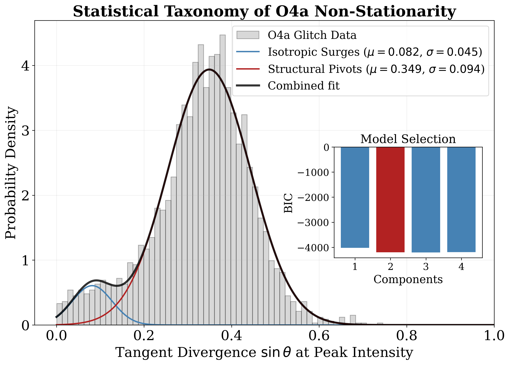
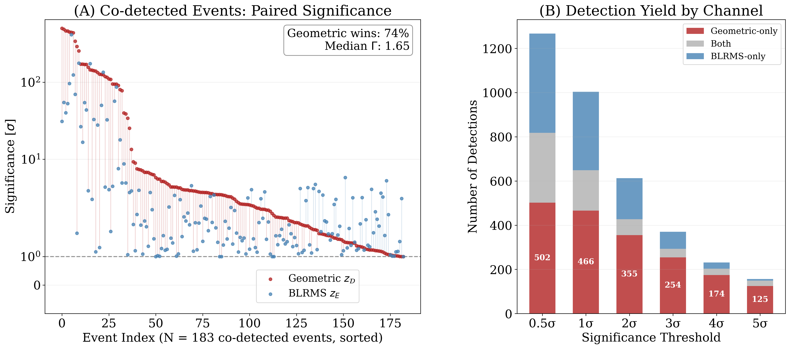

  <a class="btn btn-primary" href="https://arxiv.org/abs/2605.21531" role="button" target="_blank" style="margin-right: 10px;">
    <i class="bi bi-file-earmark-pdf"></i> Read Paper (ArXiv)
  </a>
  <a class="btn btn-outline-primary" href="https://git.ligo.org/james.kennington" role="button" target="_blank">
    <i class="bi bi-code-slash"></i> View Code
  </a>

## Limitations of Energy-Based DetChar

Gravitational-wave detectors are exquisitely non-stationary, and telling an instrumental glitch from an astrophysical signal is the daily work of detector characterization (DetChar). Most DetChar tools are **energy-based**: band-limited root-mean-square (BLRMS) monitors, for instance, watch the power in a frequency band and raise a flag when it spikes.

The trouble is that energy alone is ambiguous. A uniform gain change that lifts *every* frequency looks, to a BLRMS monitor, much like a physical reconfiguration that *redistributes* power across the spectrum, even though only the latter reshapes the noise in a way that can masquerade as, or bury, a signal. Energy-based metrics conflate global amplitude scaling with genuine spectral warps. This paper, with Zach Yarbrough, introduces a channel built to tell them apart. [@kennington_fisher_2026]

## A Geometric Model of the Noise Floor

We model the detector's power spectral density (PSD) as a **point on a Riemannian manifold**, with the Fisher information metric supplying the notion of distance between spectra. As the noise floor evolves, that point traces a trajectory, and its **velocity** is our diagnostic: *Fisher information velocity*.

The key move is to decompose that velocity geometrically. Using exterior algebra we compute the **tangent divergence** ($\sin\theta$), the component of the motion that points *across* the manifold rather than radially outward. A pure energy surge moves the PSD radially (a rescaling) and contributes little tangent divergence; a spectral warp bends the trajectory sideways. Measuring $\sin\theta$ therefore decouples simple amplitude surges from differential redistributions of power across frequency bands.

{#fig-taxonomy width=65% fig-align="center"}

## Results on O4a Data

We implemented the channel as the **`sgn-drift`** streaming pipeline and ran it over ${\sim}40$ hours of high-cadence Advanced LIGO O4a data, evaluating $N = 282{,}080$ independent manifold velocity samples. Mapping the phase space at high resolution reveals a clean **bimodal taxonomy** of severe instrumental non-stationarity: **structural pivots** (spectral warps) account for $87.2\%$ of events, and **isotropic surges** (global energy changes) the remaining $12.8\%$.

The geometric channel does more than restate what BLRMS already sees. Among co-detected events it achieves higher significance than standard BLRMS monitors in **74% of cases**, with a median sensitivity ratio of $\Gamma = 1.65$. The two methods also flag largely **non-overlapping** populations, so folding in the geometric channel grows the union catalog of flagged instrumental events by **87%** relative to BLRMS monitoring alone.

{#fig-sensitivity width=60% fig-align="center"}

## Robustness to Astrophysical Signals

A DetChar channel is only useful if it does not eat real gravitational waves. We validated the channel on **10 confirmed GWTC-4.0 events** and ${\sim}5{,}000$ simulated injections and found it robustly **insensitive to astrophysical signals**: a compact-binary chirp does not register as a spectral pivot. That makes Fisher information velocity a sensitive, complementary, and **veto-safe** diagnostic, ready to sit alongside existing monitors in current and next-generation detector networks.

## References

::: {#refs}
:::
