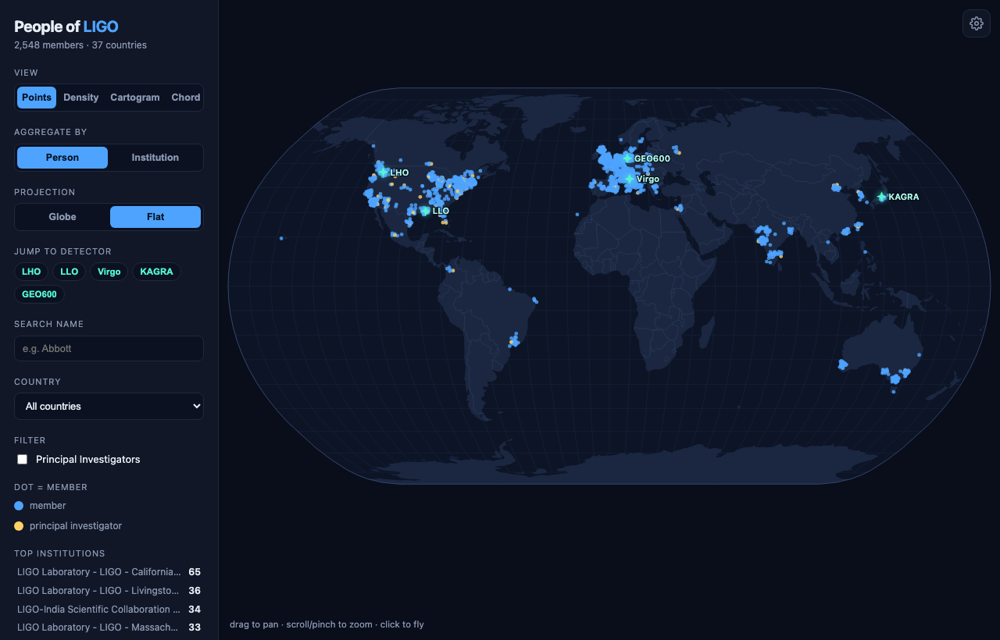

  <a class="btn btn-primary" href="https://docs.ligo.org/james.kennington/people-of-ligo-map/" role="button" target="_blank" style="margin-right: 10px;">
    <i class="bi bi-play-circle"></i> Launch Live App
  </a>
  <a class="btn btn-outline-primary" href="https://git.ligo.org/james.kennington/people-of-ligo-map" role="button" target="_blank">
    <i class="bi bi-git"></i> View Source
  </a>

## The Collaboration, Made Visible

LIGO is not a single laboratory but a collaboration of thousands of people scattered across the world: some 2,500 members at institutions in 37 countries. That scale is easy to state and hard to feel. I wanted a way to see it at a glance, so I built an interactive globe of the collaboration directly from the public [LSC Directory roster](https://roster.ligo.org/).

{#fig-pol width=100%}

## What You Can Do

The roster comes to life through a few complementary views:

* _Points, density, cartogram:_ Show every member (or institution) as a dot on a rotatable globe, a hexbin heat map of where people concentrate, or a Dorling cartogram of institution circles sized by headcount.
* _Aggregate and filter:_ Toggle between person and institution counts, switch between globe and flat projections, and filter by country or Principal Investigator.
* _Fly around:_ Search a name and press Enter to fly to that member, click any cluster or detector to zoom in, and browse an insights panel of the top institutions and countries. The current view is shareable through the URL, and any view exports to PNG.

## Science Layers

Beyond the roster, a set of layers connects the people to the physics they do:

* _Detector network:_ Great-circle baselines between the five observatories (LIGO Hanford and Livingston, Virgo, KAGRA, and GEO600).
* _Gravitational-wave wavefront:_ A "Play GW wave" control sweeps a wavefront across the globe, and the detectors flash in their true relative arrival-time order, a small illustration of how the network localizes a source on the sky.
* _Day and night:_ A live solar terminator, with a running count of how many members are in daylight right now.
* _Affiliation arcs and leadership:_ Great-circle lines from each institution to the detector it works on, plus the collaboration's leadership structure pinned on the map by division.

## Under the Hood

The app is entirely client-side: vanilla ES modules and a vendored copy of D3, with no build framework, no CDN, and no runtime API calls. The interesting part is the split between the app and its data. A CI pipeline does the heavy lifting ahead of time: it politely crawls the public roster, geocodes each institution, joins and aggregates the result, and embeds the finished data into the bundle at build time. The deployed app never contacts the roster itself, so it loads instantly and depends on nothing at runtime.
