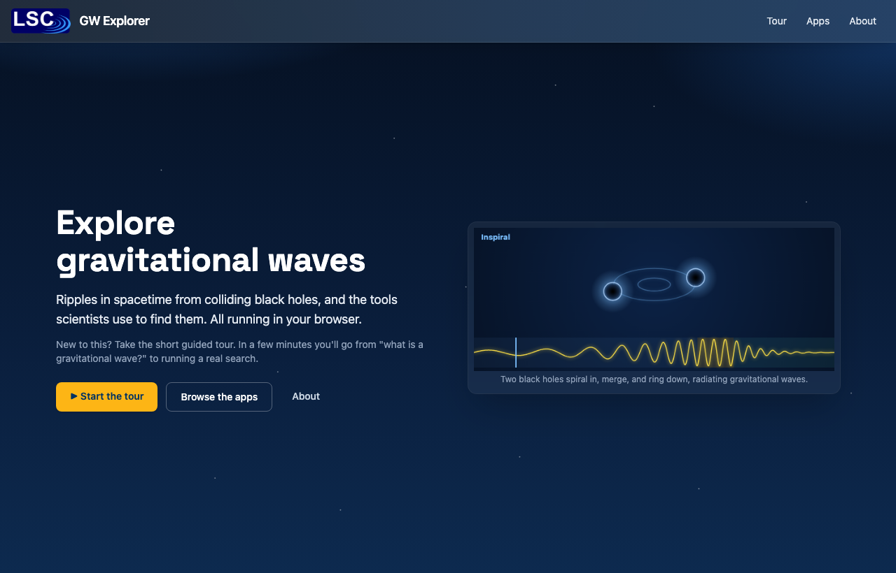
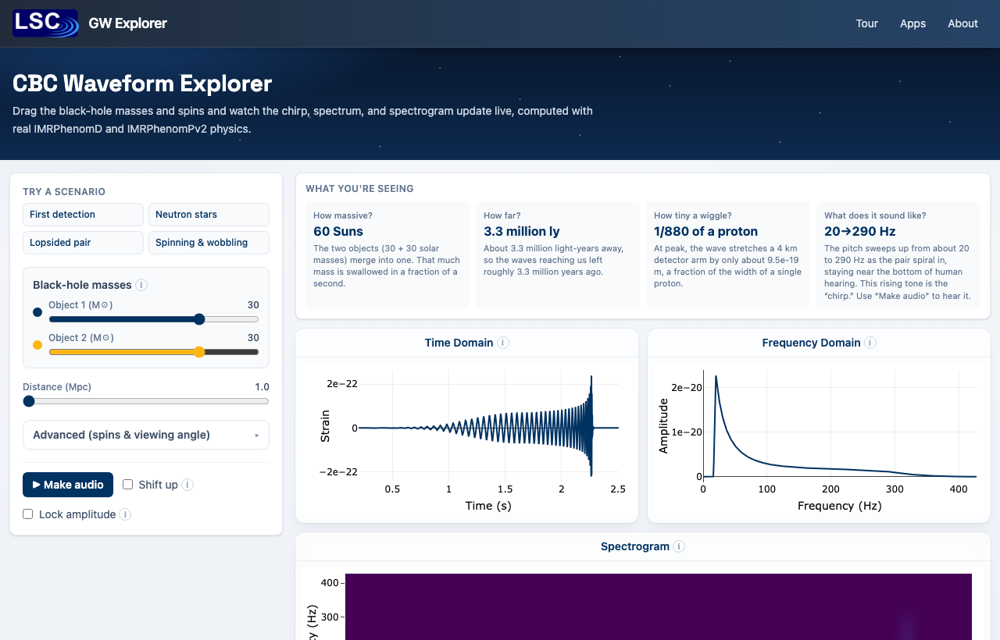
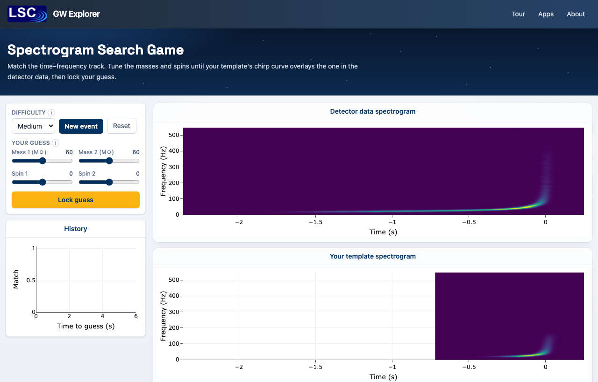

  <a class="btn btn-primary" href="https://docs.ligo.org/james.kennington/gw-explorer/" role="button" target="_blank" style="margin-right: 10px;">
    <i class="bi bi-play-circle"></i> Launch Live App
  </a>
  <a class="btn btn-outline-primary" href="https://git.ligo.org/james.kennington/gw-explorer" role="button" target="_blank">
    <i class="bi bi-git"></i> View Source
  </a>

## From Camp Handouts to a Browser Exhibit

For the 2024 PSU Science-U Gravitational Waves Camp I wrote a set of Python apps to teach students how a compact binary coalescence (CBC) search works, alongside a standalone Dash tool for [digital filter design](20241101-app-dsp-filter.qmd). They did the job, but each needed a Python server, and the physics leaned on LALSuite and SciPy running behind the scenes.

**GW Explorer** is the browser-native successor: a single-page app that consolidates those tools into one guided exhibit and moves all of the physics into the browser itself.

{#fig-portal width=100%}

## What's Inside

* _CBC Waveform Explorer:_ Dial in component masses and spins and watch the time-domain strain, the frequency-domain amplitude, and the spectrogram update live, using real IMRPhenomD and precessing IMRPhenomPv2 waveforms.
* _DSP Filter Explorer:_ Drag poles and zeros and see the Bode and impulse responses respond in real time, the successor to my earlier Dash filter app.
* _Search games:_ Four ways to play a parameter-estimation search (visual, audio, spectrogram, and matched-filter SNR), tuning masses and spins until your template matches a hidden event.

{#fig-waveform width=100%}

{#fig-game width=100%}

## Putting LALSuite in the Browser

The interesting engineering was removing the server. The original apps generate waveforms with LALSuite's `lalsimulation`. Because IMRPhenomD is an analytic, closed-form frequency-domain model rather than a numerical simulation, I could port its actual equations and calibrated coefficients (and the IMRPhenomPv2 precession layer) directly to TypeScript, the same way the old app ported SciPy's filter routines.

The result is a genuine waveform approximant running entirely client-side. It is validated against reference waveforms dumped from LALSuite: the PhenomD strain matches to better than one part in $10^5$, and the precessing PhenomPv2 polarizations agree to comparable precision across single- and double-spin systems. There is no server, no LALSuite, and no SciPy in the deployed app.

## Tech Stack

GW Explorer is built with Vite and TypeScript, React 19 and Tailwind CSS, a hash router for clean GitLab Pages hosting, Zustand for state, and Plotly.js for the graphics. The build is fully static, and the whole exhibit, physics included, runs from a single set of files with nothing behind it.
